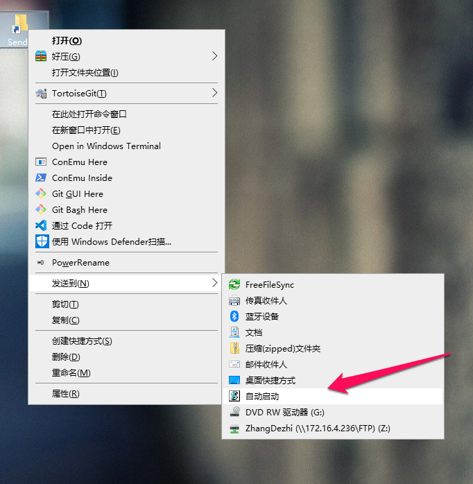

# Windows扩展脚本

Windows常用目录说明
```
%AppData%\Microsoft\Windows\SendTo                         #发送到文件夹
%AppData%\Microsoft\Windows\Start Menu\Programs\Startup    #程序自启动目录


```

## 脚本说明

### 自动启动.vbs    
> 说明: 发送快捷方式到自动启动目录

安装: 
将脚本或者快捷方式放入%AppData%\Microsoft\Windows\SendTo 文件夹内既可

效果:


